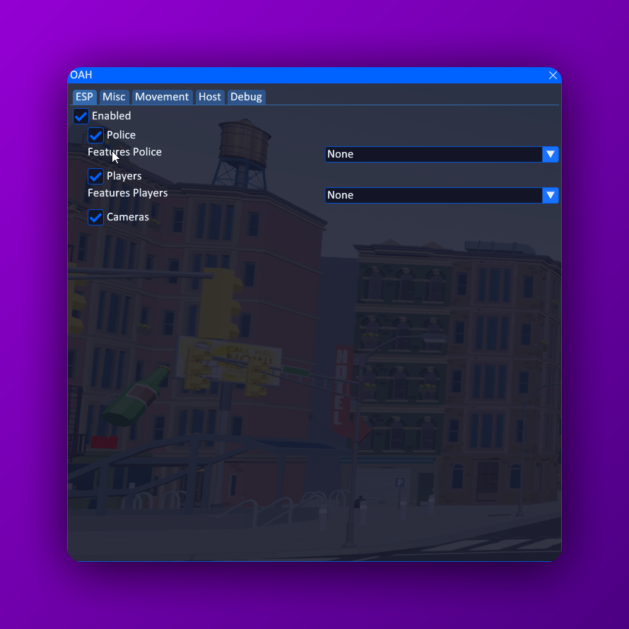

# 🔥 One Armed Hacker
OAH is a simple cheat made for the game One-Armed Robber. It's a very fun game, but to enjoy it fully it does require simple cheats like speedhack. OAH provides that and much more

<p align="center">
  
</p>

## 🚀 Features
### 👁️ ESP:
- Police
- Player
- Camera

### ⚡ Misc:
- **Level hack**
- **Cash hack**
- **Drill immunity time**
- **Last bullets damage**
- **Damage immunity**

### 🏃 Movement:
- **Speed**: Increase your movement speed.
- **Jump**: Modify your jump height.
- **Fly hack**:
    - No clip

### 🎮 Host Features:
*(Note: These features might not work on certain maps or may only be visible when hosting or playing locally.)*
- **Custom guard phone time**
- **Kill targets**:
  - Civilians
  - Rats
  - Police
  - Doors
  - Cameras
  - Breakable glass



## 🤝 Contributions
Contributions are welcome! This project is no longer actively maintained and community contributions are required to keep it alive. Feel free to submit a pull request wether it's cleaning up the code, fixing bugs, updating the SDK or adding new features.

## 🛠️ How to Use
OAH is a C++ project designed to work on Windows using Visual Studio.

### ⚙️ Build Instructions
1. **Clone the Repository**:
   Open your terminal or Git Bash, and clone the repository:
   ```bash
   git clone https://github.com/fluffysnaff/oah.git
   ```
2. **Open the Project in Visual Studio**:
    - Launch Visual Studio
    - Open the .sln file located in the cloned repository
    - Build with x64-Release
    
### 🔄 Updating instructions
1. Inject a dumper7.dll into OAR-Win64-Shipping.exe
2. Go to `C:/Dumper-7/` and copy the latest `/CppSdk`

### 👏 Credits
- Kio - [For helping start with the dumping and integrating the SDK](https://github.com/k-i-o/UE-OAR-Internals)
- Spuckwaffel - [UEDump](https://github.com/Spuckwaffel/UEDumper)
- Encryqed - [Dumper7](https://github.com/Encryqed/Dumper-7)
- Rebzzel - [DX11 hook](https://github.com/Rebzzel/kiero)